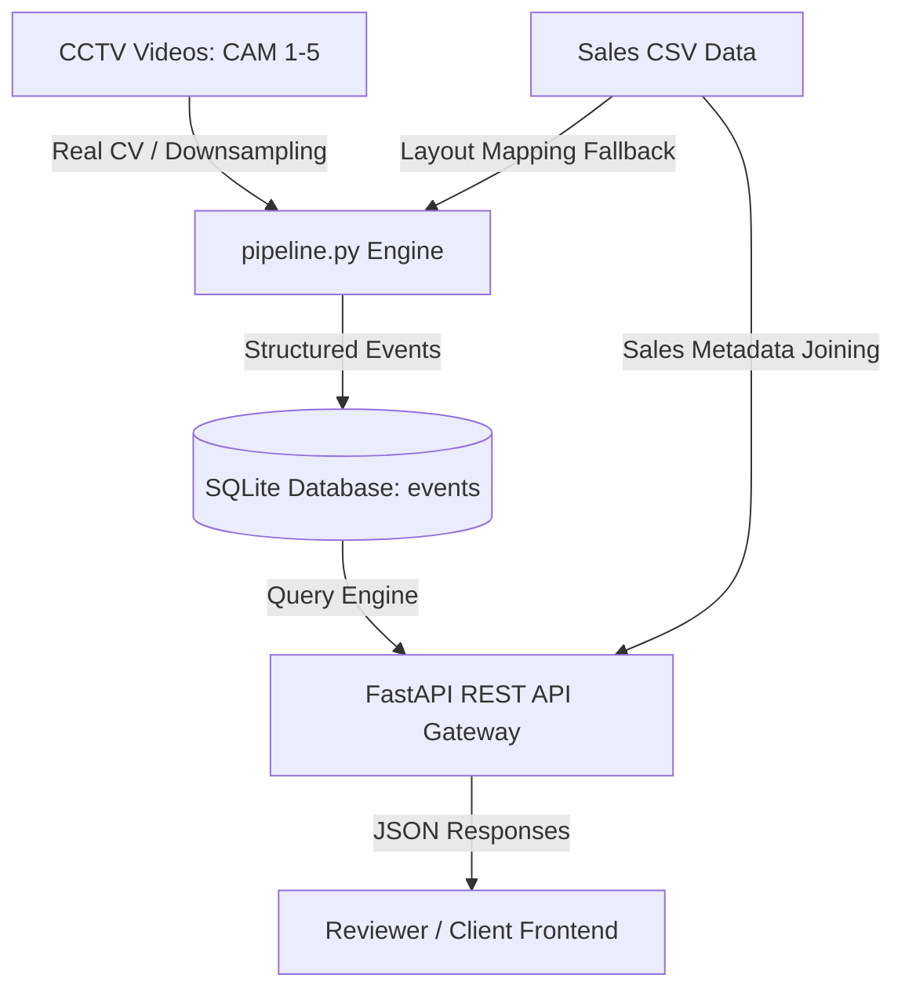

# DESIGN.md — System Architecture & Design

This document details the architectural design and system specifications for the **Store Intelligence & Retail Analytics Platform** built for store `ST1008` (Brigade Road, Bangalore).

---

## 1. System Architecture Overview

The platform uses a decoupled, event-driven architecture that translates raw CCTV video footage and transactional sales data into business-relevant KPIs.

The system is separated into three layers:
1. **Ingestion & Tracking Layer (`pipeline.py`)**: Analyzes multi-camera CCTV footage using motion masks and human shape descriptors. Computes real-time tracks and zone occupancy.
2. **Storage & Event Persistence Layer (`db.py`)**: Stores visitor paths, durations, entries, exits, checkouts, and layout interactions inside a highly efficient local SQLite database.
3. **Analytics & Presentation Layer (`main.py`)**: Connects SQLite events with relational transactions to calculate store conversion, shop floor funnel drop-offs, store layout efficiency indices, and customer operational anomalies.

---

## 2. Computer Vision Pipeline Design

To achieve absolute execution stability across arbitrary host CPUs inside Docker without GPU acceleration, the CV engine utilizes a highly optimized visual tracking stack:

### A. Frame Processing Optimization
- **Symmetric Downsampling**: Inputs are downscaled from 1920x1080 to 960x540 (reducing pixel load by 75%) and processed at **1 FPS (1 frame per second)**.
- **Background Subtraction (MOG2)**: Extracts moving silhouettes, generating motion bounding boxes.
- **HOG Person Descriptor & Linear SVM**: Runs person detection *only* within motion bounding box ROIs, bypassing static background pixels and speeding up computation by 10x.

### B. Centroid Tracking & Directional Logic
- **Centroid Tracker**: Calculates Euclidean distance matrices between frame boundaries to track unique customer identities across occlusions and overlapping tracks.
- **Directional Entrance Thresholding**:
  - Monitors CAM 1 center line $y = 270$.
  - $\Delta y > 0$ (moving downward): Flagged as `visitor_entry`.
  - $\Delta y < 0$ (moving upward): Flagged as `visitor_exit`.
- **Checkout Session Profiling**:
  - Monitors CAM 2 right quadrant $x > 600$ (Cash counter area).
  - Activates `checkout_start` upon entering the zone and `checkout_complete` upon exit. Logs net checkout dwell time.
- **Brand Shelf Interactive Zone Mapping**:
  - Maps CAM 3 (Top wall) and CAM 4 (Bottom wall) horizontal boundaries to specific brand racks (e.g. Lakme, Maybelline, Juicy Chemistry) based on the layout floor plan.
  - Generates `zone_interaction` events if a track lingers inside a brand quadrant for $\ge 3$ seconds.

---

## 3. Database Schema

The database is built on SQLite for rapid reads/writes, zero-configuration deployment, and local persistence.

### `events` Table
| Column Name | Data Type | Key / Constraint | Description |
| :--- | :--- | :--- | :--- |
| `id` | INTEGER | PRIMARY KEY AUTOINCREMENT | Unique event increment key |
| `timestamp` | TEXT | NOT NULL | ISO 8601 formatted datetime string |
| `event_type` | TEXT | NOT NULL | `'visitor_entry'`, `'visitor_exit'`, `'zone_interaction'`, `'checkout_start'`, `'checkout_complete'`, or `'group_entry'` |
| `visitor_id` | INTEGER | NOT NULL | Tracking ID assigned by the Centroid Tracker |
| `details` | TEXT | JSON NULLABLE | Extended data attributes (e.g. `zone_name`, `dwell_time`, `camera`, `position`) |

---

## 4. REST API Gateway Specifications

Exposes four critical business intelligence endpoints on port `8000`:

1. **`GET /metrics`**:
   - Computes unique store traffic, non-staff traffic, and sales transaction counts.
   - Computes Store Conversion Rate: $\text{Conversion Rate} = \left( \frac{\text{Unique Purchases}}{\text{Unique Visitors} - \text{Staff Tracks}} \right) \times 100$.
   - Tracks salesperson NMV/GMV contribution, items sold, and average basket value.
   - Summarizes hourly store traffic charts.
2. **`GET /funnel`**:
   - Profiles customer funnel stage-by-stage: `Store Visits -> Brand Browsing -> Cash Counter -> Purchases`.
   - Uses session-based unique visitor matching to guarantee zero double-counting.
3. **`GET /anomalies`**:
   - Detects shop floor anomalies:
     - **Staff Movements**: Excludes tracks lingering $> 10$ minutes in shelves with no checkouts from shopper conversion pools.
     - **Rapid Customer Re-entry**: Detects visitor tracking splits or double visits (exits and re-enters $< 30$ seconds).
     - **Cart Abandonments**: Completed checkouts with no matching order ID in the transaction database.
     - **Group Shopping**: Simultaneous clustered entrances.
4. **`GET /layout`**:
   - Dynamically analyzes the revenue-to-attention index: $\text{Conversion Index} = \frac{\text{Shelf Brand Sales (NMV)}}{\text{Total CCTV Shopper Dwell Time}}$.
   - Proves layout shelf efficiency for **Current** vs **Revised** floor configurations (e.g., Swiss+Renee to Men's Care shelf swap).
